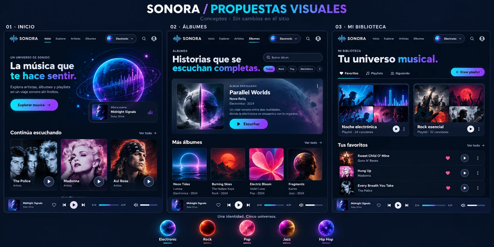

# Referencia visual de SONORA

La imagen elegida por el usuario es la referencia fija para futuros cambios visuales del sitio:

- Conservar la identidad futurista de SONORA y la tipografía del sitio.
- Inicio: planeta oscuro azul/cian y violeta, órbitas finas y espectro diagonal sobre el globo, siguiendo el panel 01 de la imagen.
- Mantener una composición limpia y proporcionada. Los efectos musicales deben acompañar el diseño de referencia.
- Universos: siete planetas distintos, con sus texturas y colores, como en la franja inferior de la imagen.
- Usar los paneles 02 y 03 como referencia al trabajar Álbumes y Mi biblioteca.

La captura es una referencia de diseño; los textos, artistas y canciones deben corresponder al catálogo real de SONORA.

- Celestial: música cristiana, azul profundo, blanco perlado y dorado suave; atmósfera serena y halo fino.
- Aurora: música romántica, borgoña, cobre y champán; textura oscura y anillos cálidos. Evitar rosa/coral para distinguirlo de Pop.
- Las etiquetas temáticas (`data-theme-tags`) complementan el género original: una canción puede ser Rock y pertenecer también a Aurora. No clasificar canciones como cristianas por su título.
